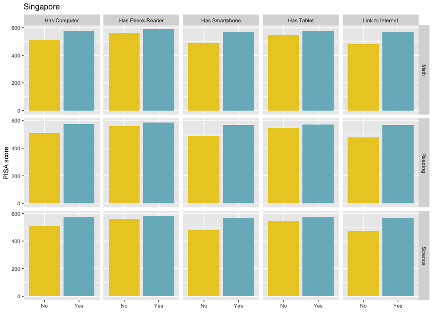

# Using PISA score to observe learning outcomes gap between connected vs unconnected students
*Medium link can be found [here](https://hamidahlearnstowrite.medium.com/connectivity-and-achievement-gaps-315460607150)*

It has been more than a year since the COVID-19 pandemic began. Although we could start to see the light at the end of the tunnel as the vaccination rate and eligibility coverage are expanding each day, the disruption caused by this pandemic is more likely to last longer than the pandemic itself. One of the many sectors that are significantly impacted by this pandemic is the education sector. During the COVID-19 pandemic, school closures have pushed students and teachers in 170 countries to adopt distance learning and explore the education technology options. However, this technological solution created a growing concern that it might create gaps in learning outcomes, especially between students with access to Information and Communication Technologies (ICT) devices and those who do not. The World Bank called this a paradox faced by many countries; Although the digitally-enabled remote learning option is the most efficient way to minimize the learning losses, they also risk widening the education gap.

Previously, we know from a wealth of studies that the achievement gaps exist between students’ socioeconomic status, race, and gender. However, few studies have also observed that the learning gap between connected and unconnected students has existed even before the COVID-19 pandemic. This time, I will use the Programme for International Student Assessment (PISA) data to confirm this finding and affirm a few lessons on the linkage between digital connectivity and learning outcomes. PISA is survey data that includes a literacy measurement of 15-year-old students in reading, mathematics, and science. In the 2018 version, the most recent assessment, PISA data contains information on literacy scores and several characteristics of students from 79 countries.

Average PISA Score for Singapore by Subject and ICT Devices Ownership Students without access to ICT devices are significantly behind compared to their “connected” cohorts. This gap exists across countries regardless of their overall PISA score. In Singapore, countries with a high PISA score in general (rank 2 on average of three subjects), the connected students consistently perform higher anywhere between 4–16 percent across the three subjects, Reading, Mathematics, and Science. A similar gap is also seen in Indonesia, a country with a low PISA score in general (rank 71 on average of three subjects). Being connected in Indonesia is associated with higher average students’ test scores of 2–17 percent.

After adjusting for economic index and learning times for each student, we still observe the gap between students with internet access and those who do not. The gaps persist but vary across countries and PISA subjects.

Some research has shown how the learning inequality between students’ race and socioeconomic status has been compounded by the school shutdowns. The charts above emphasize that the other dimension that might exacerbate this wide gap is the ownership and access to digital devices. Therefore, this should be embedded in the recovery plan of governments and educators in all countries.

While strengthening the school’s digital capabilities is one way to provide remedial education efforts, efforts in ensuring all students have access to digital devices and the internet should be continuously implemented even after all students come back to school.
